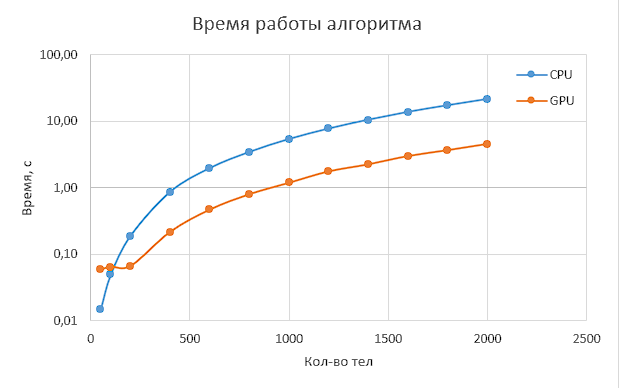
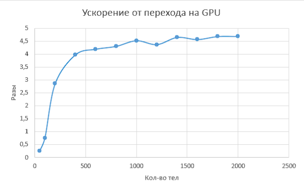
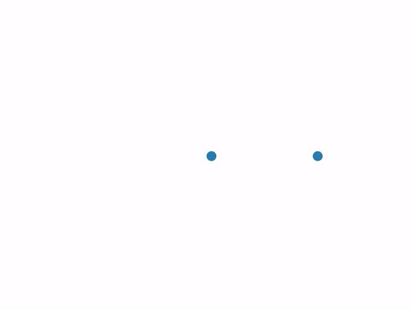
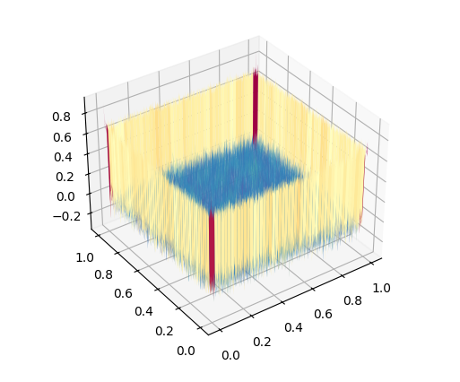
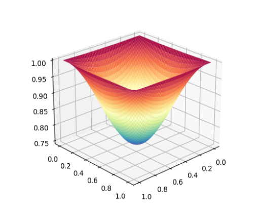

<h1 align="center">
Thread lab 3
</h1>

Для замеров использовались: 
CPU: Ryzen 5600x 
GPU: NVIDIA GTX 1660 
Выполнили: Козин Борис (21пи-3), Столетов Максим (21пи-2), Гурьянов Илья (21пми-1)

## Задание 1 (Задача n тел)

### Описание алгоритма

Алгоритм основан на решении n дифференциальных уравнений, которые позволяют получить траектории всех частиц. Для
решения используется метод Эйлера. В результате получаются итерационные формулы для решения уравнений.

Так как на каждой итерации расчеты не зависят друг от друга, то они были представлены в виде операций с матрицами и
распараллелены с использованием cuda (а именно библиотеки cupy).

### Оценка работы алгоритма

|  |  |
|:-------------------------:|:-------------------------:|

### Примеры визуализаций

  <table style="width: 100%; table-layout: fixed;">
    <tr>
      <td style="text-align: center; width: 50%; vertical-align: top;">
        

          
          
3 случайных тела

        

      </td>
      <td style="text-align: center; width: 50%; vertical-align: top;">
        

          
          
Земля и Солнце

        

      </td>
    </tr>
  </table>

## Задание 2 (Решение задачи Дирихле)

### Описание алгоритма

**Задача Дирихле** — это краевая задача для эллиптических дифференциальных уравнений, где на границе области
задаются постоянные значения функции.  
В начале матрица заполняется случайными числами, после чего, через итерационный процесс, вычисляются новые значения на
сетке. Распараллеливание происходит с помощью использования директив препроцессора из OpenMP.

### Описание сходимости

Точность, предложенная в учебнике, мала, даже для сходимости небольшого числа точек, не говоря о
предложенных 5000 точек. Поэтому мы использовали свою.

  <table style="width: 100%; table-layout: fixed;">
    <tr>
      <td style="text-align: center; width: 50%; vertical-align: top;">
        

          
          
Точность из учебника

        

      </td>
      <td style="text-align: center; width: 50%; vertical-align: top;">
        

          
          
Предложенная нами точность

        

      </td>
    </tr>
  </table>

### Оценка работы алгоритма

|  |  |
|:---------:|:---------:|
|  |  |

## Анализ полученных результатов

* **Ускорение**:
* **Эффективность**:

## Заключение