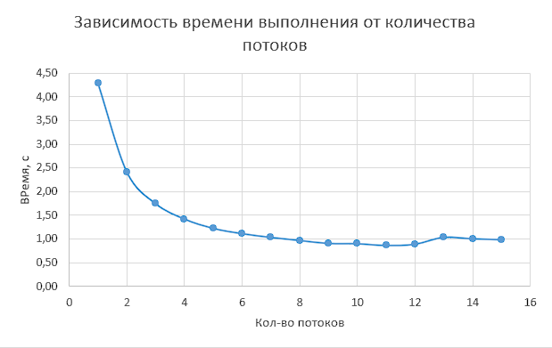

<h1 align="center">
Thread lab 3
</h1>

Для замеров использовались: 
CPU: Ryzen 5600x 
GPU: NVIDIA GTX 1660 
Выполнили: Козин Борис (21пи-3), Столетов Максим (21пи-2), Гурьянов Илья (21пми-1)

## Задание 1 (Задача n тел)

### Описание алгоритма

Алгоритм основан на решении n дифференциальных уравнений, которые позволяют получить траектории всех частиц. Для
решения используется метод Эйлера. В результате получаются итерационные формулы для решения уравнений.

Так как на каждой итерации расчеты не зависят друг от друга, то они были представлены в виде операций с матрицами и
распараллелены с использованием cuda (а именно библиотеки cupy).

### Оценка работы алгоритма

|  |  |
|:-------------------------:|:-------------------------:|

### Примеры визуализаций

<!-- prettier-ignore-start -->
<!-- markdownlint-disable -->
<table>
  <tbody>
    <tr>
      <td align="center" valign="top" width="50%">
        

          
          <figcaption>3 случайных тела</figcaption>
        

      </td>
      <td align="center" valign="top" width="50%">
        

          
          <figcaption>Земля и Солнце</figcaption>
        

      </td>
    </tr>
  </tbody>
</table>
<!-- markdownlint-restore -->
<!-- prettier-ignore-end -->

## Задание 2 (Решение задачи Дирихле)

### Описание алгоритма

**Задача Дирихле** — это краевая задача для эллиптических дифференциальных уравнений, где на границе области
задаются постоянные значения функции.

В начале матрица заполняется случайными числами, после чего, через итерационный процесс, вычисляются новые значения на
сетке. Распараллеливание происходит с помощью использования директив препроцессора из OpenMP.

### Описание сходимости

Точность, предложенная в учебнике, мала, даже для сходимости небольшого числа точек, не говоря о
предложенных 5000 точек. Поэтому мы использовали свою.

<!-- prettier-ignore-start -->
<!-- markdownlint-disable -->
<table>
  <tbody>
    <tr>
      <td align="center" valign="top" width="50%">
        

          
          <figcaption>Точность из учебника</figcaption>
        

      </td>
      <td align="center" valign="top" width="50%">
        

          
          <figcaption>Предложенная нами точность</figcaption>
        

      </td>
    </tr>
  </tbody>
</table>
<!-- markdownlint-restore -->
<!-- prettier-ignore-end -->

### Оценка работы алгоритма

|  |  |
|:--------------------------:|:--------------------------:|
|  |  |

## Анализ полученных результатов

* **Ускорение**:Ускорение программы значительно увеличивалось с ростом числа потоков, что свидетельствует о
  преимуществе параллельных вычислений. Однако после 11-12 потоков, увеличение ускорения прекратилось из-за исчерпания
  аппаратных ресурсов.
* **Эффективность**: Максимальная эффективность при распараллеливании наблюдалась при 1 потоке. Эффективность
  использования ресурсов падала по мере увеличения их числа.

## Заключение

Использование GPU для вычислений позволяет значительно ускорить выполнение программы на больших объемах данных. Однако,
на крайне малых объемах данных, использование GPU может замедлить выполнение программы из-за больших накладных расходов.

Использование параллельных вычислений позволяет существенно ускорить выполнение программы. Оптимальное количество
потоков не превышает количество физических потоков процессора, также дальнейшее увеличение числа потоков замедляет
выполнение программы.